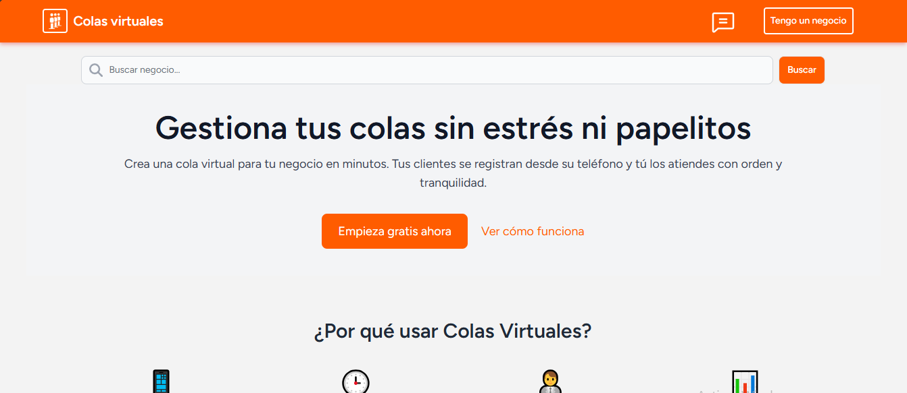
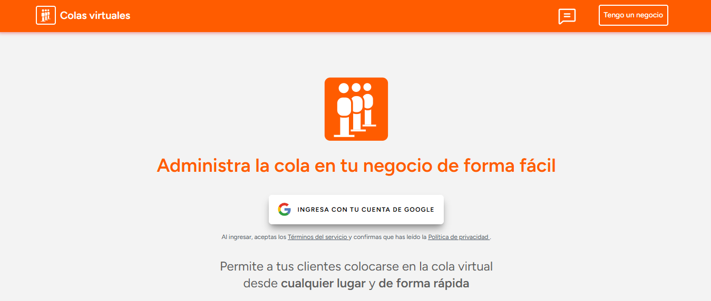
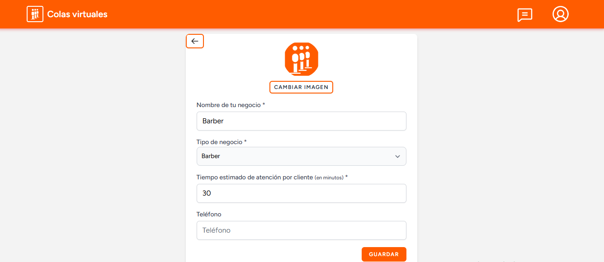
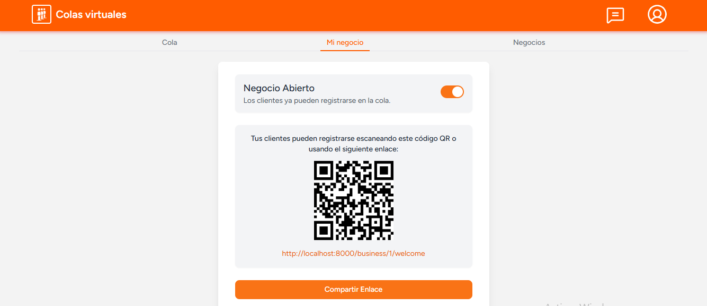
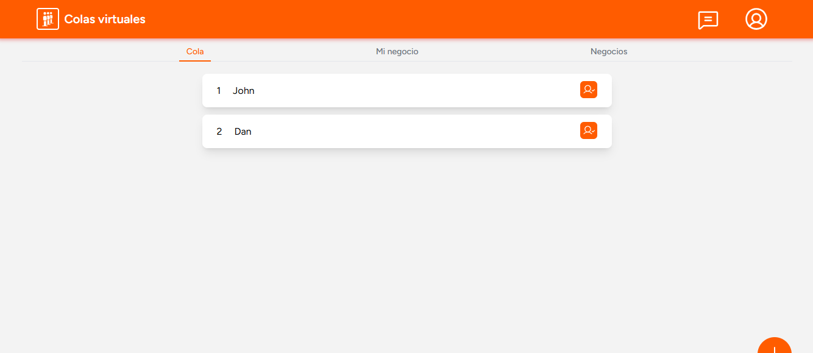
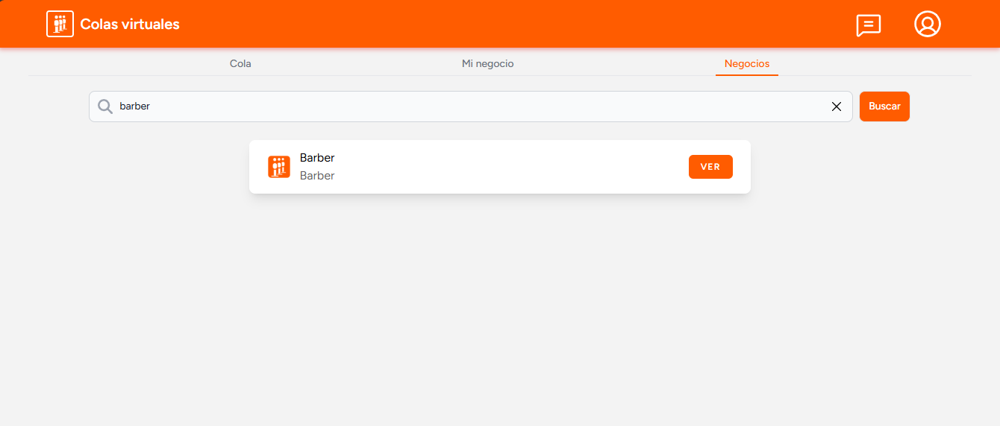
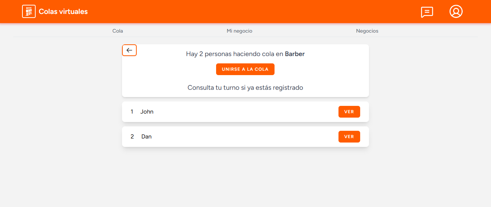
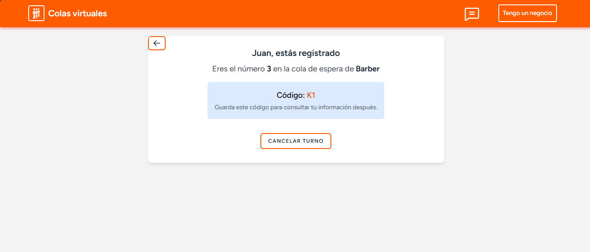
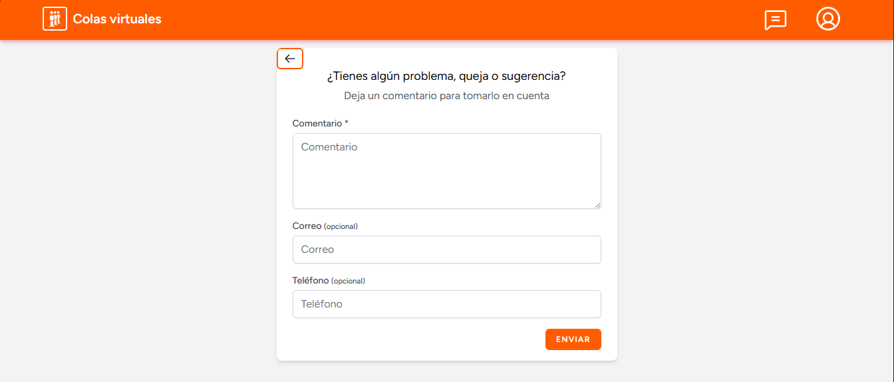

# Kiu

Kiu is a web app that lets businesses and clients manage queues online. Businesses can handle clients in real time, while clients can join and track queues from anywhere and no more waiting in line.

---

## Features

### For Businesses

* Register business information: name, profile, address, and phone number.
* Manage queues by adding new clients or marking them as attended.
* Share queue links easily with clients via direct link or QR code.

### For Clients

* Register and join queues from anywhere.
* View the current queue in real time.
* Cancel your turn if needed.
* Search for different businesses on the platform to join their queues.

---

## Stack

* Laravel
* Laravel Breeze
* Laravel Reverb
* Tailwind CSS
* Google Login

---

## Getting Started

### Installation

1. Clone the repository:

```bash
git clone https://github.com/hugoruiz00/kiu.git

cd kiu
```

2. Install dependencies:

```bash
composer install
npm install
```

3. Copy the environment file and generate an app key:

```bash
cp .env.example .env
php artisan key:generate
```

4. Set up your database in `.env`:

```env
DB_CONNECTION=mysql
DB_HOST=127.0.0.1
DB_PORT=3306
DB_DATABASE=
DB_USERNAME=
DB_PASSWORD=
```

5. Install Reverb:

```bash
php artisan reverb:install
```

6. Set up your Google credentials for Google login:

```env
GOOGLE_CLIENT_ID=
GOOGLE_CLIENT_SECRET=
GOOGLE_REDIRECT_URI=
```

In Google Cloud Console, configure the redirect URI for development as:

```
http://localhost:8000/login/google/callback
```

7. Run migrations and seeders:

```bash
php artisan migrate --seed
```

8. Create a storage link:

```bash
php artisan storage:link
```

---

### Running the Project

```bash
php artisan serve
php artisan reverb:start
php artisan queue:work
npm run dev
```

Then visit [http://localhost:8000](http://localhost:8000) in your browser.


### Screenshots

##### Home page


##### Login


##### Register business info


##### Share queue link


##### Check queue


##### Search business for clients


##### Check queue for clients


##### Client registered


##### Comment section



## License

This project is licensed under the MIT License - see the [LICENSE](LICENSE) file for details.